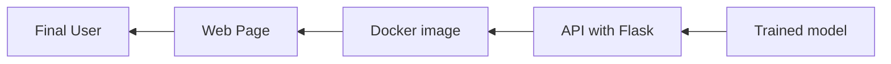
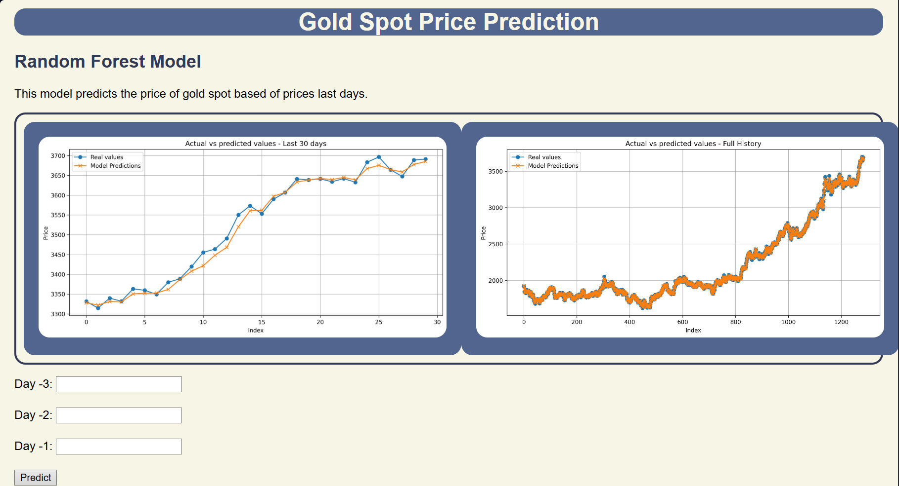

# Project ML - Random Forest API with Docker and Flask
This repository has a project that focuses on creating an API and exposing the model on a web page.

## 1. Description

This project implements a **Random Forest model** that performs predictions using the **data from the last 3 days**.

The model is exposed through a **REST API with Flask**, and using **Docker**, an image is created so that the service can be easily deployed and accessed from a web page.

The main objective is to show the process of **using a trained model, exposing it through an API and making it accessible via the web**

---

## 2. Flujo del Proyecto



## 3. Technologies used
* Python 3.13
* Flask (REST API)
* Docker (Image)
* HTML/JS (For API consumption)

## 4. Installation and execution with Docker

1. Clone the repository
```bash
   git clone https://github.com/haroldcuellar24/ml-model-deployment-api.git
```
2. Build the image
```bash
   docker build -t ml-api .
```
3. Run the container
```bash
   docker run -p 5000:5000 ml-api
```
4. Access it at:
```bash
    http://127.0.0.1:5000
```

## 5. Example of using the API

The API is available at the route '/predict'.

Request(POST)
```json
    {
    "features": [3200, 3250, 3100]
    }      
```
Response
```json
    {
    "prediction": 3239
    }
```

## 6. Frontend

The web page connects to the '/predict' endpoint of the API in Flask and displays the model’s predictions in an interactive form for the user. You can also try it with Postman.

Preview


## 7. Next steps
* Add validation and metrics for the Random Forest model
* Implement an automated pipeline (training + validation + deployment)